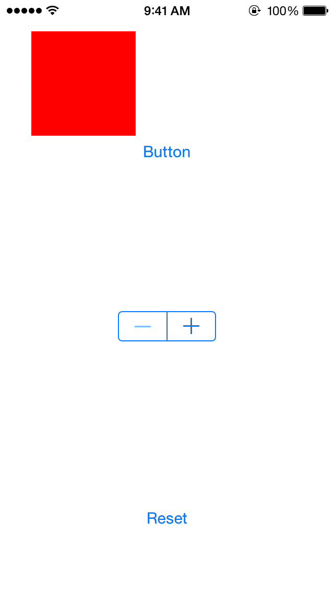

# SFZoomView

[](https://travis-ci.org/Simon Fortelny/SFZoomView)
[](http://cocoapods.org/pods/SFZoomView)
[](http://cocoapods.org/pods/SFZoomView)
[](http://cocoapods.org/pods/SFZoomView)

Easily zoom Views in out of view.

## Example


To run the example project, clone the repo, and run `pod install` from the Example directory first.

## Usage

Zoom in
```
[view sf_zoomIn];
```

Zoom out
```
[view sf_zoomOut];
```

Add a view to the view hierarchy zoomed out
```
UIView *zoomedOutView = [[UIView alloc]initWithFrame:CGRectMake(30, 30, 100, 100)];
[zoomedOutView sf_makeZoomedOut];
[self.view addSubview:zoomedOutView];
```

## Installation

SFZoomView is available through [CocoaPods](http://cocoapods.org). To install
it, simply add the following line to your Podfile:

```ruby
pod "SFZoomView"
```

## Author

Simon Fortelny, sforteln@gmail.com

## License

SFZoomView is available under the MIT license. See the LICENSE file for more info.
